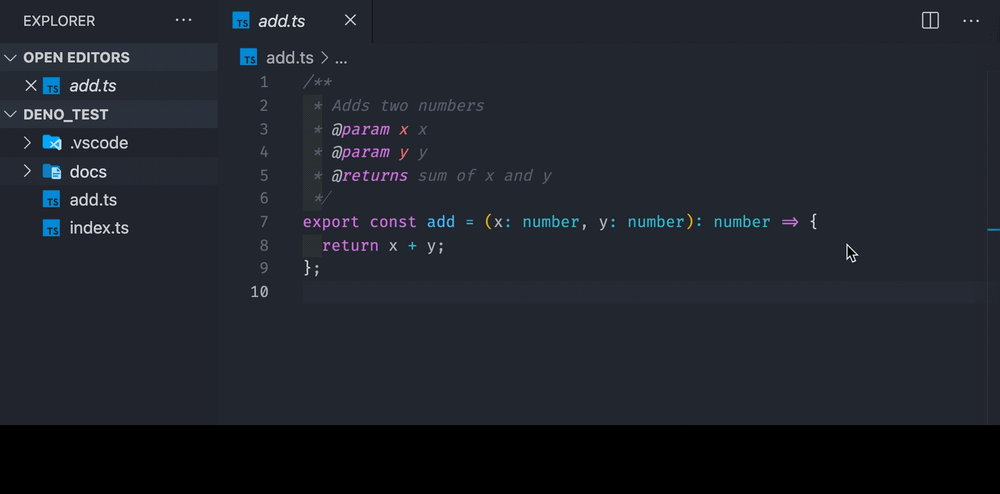

# Readme

Easily link from comments to external files or documentation. 

## Features


* Within a comment, add a link by enclosing it in double "[" brackets ie 
> [[docs/readme.md]]

* Searches from the root of your workspace, but it also works with relative paths!
> [[./docs/folder/readme.md]]

## Requirements

Currently, this extension only supports files where comments are delimited by `/*`, `//`, `*`, `<!--` or `#`. So, it should work with Javascript/Typescript, Python, HTML files and any other languages .

Currently you can only add one link per line. If you need multiple links, add each one on a different line.

## Extension Settings

No settings to change. Just enable and enjoy! 
CodeLens hints will display above any comment with a valid filename.

## Known Issues

As it parses line-by-line, it won't properly detect when a link is within a multi-line comment unless the line starts with one of the delimiters. For instance, 


*This won't work!*
```typescript
/*
  This link won't work [[docs/readme.md]]
*/
```

A simple workaround is just to add a comment delimiter to the beginning of every line with a link, regardless of whether it's required or not. 

```typescript
/*
 * This link is working now! [[docs/readme.md]]
 */
```

## Release Notes

### 1.0.0

Initial release of CommentLinks


## Future Roadmap
- Ability to link to a specific heading in a markdown file
- Tooling to help with refactoring - when files are renamed / moved, updating their comment links
- Better comment detection
- Tests